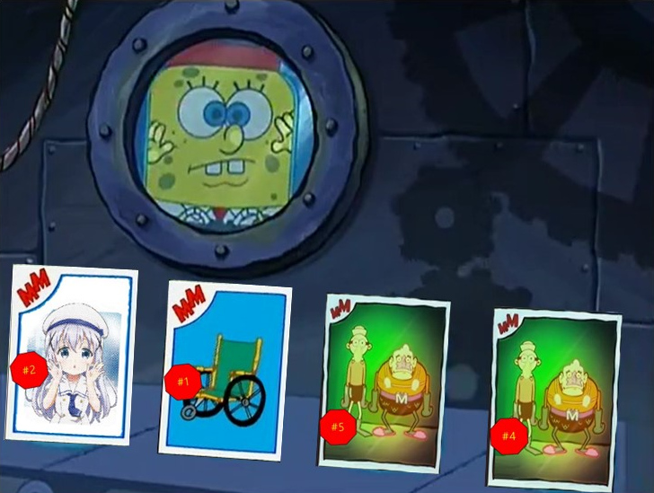

# 公平洗牌

比奇堡最近上架了全新的海超人與大洋遊俠卡，其中最稀有的就是僅有五張的 $54$ 號卡。  
而為了抽到 $54$ 號卡，海綿寶寶花光了所有的錢買海超人與大洋遊俠卡包，但卻都沒中獎，而派大星僅買了一包，就五張全中了 $54$ 號卡。

　　　　　　　　　　　　　　　{ height=200px }  

為了改善這奇怪的卡牌分布，海綿寶寶來到了卡包製作的工廠。

　　　　　　　　　　　　　　　{ height=200px }  

海綿寶寶發現工廠裡有 $N$ 張卡片，而每張卡片上都有自己獨特的編號。  
他決定把所有卡片按順序蒐集起來後洗牌，藉此打亂卡片的排列。  
而每次洗牌後，位置在第 $i$ 張的卡會變成第 $F_i$ 張卡。

海綿寶寶希望進行 $K$ 次洗牌，但由於工程浩大，於是得請你幫忙他了。

\clearpage

## 輸入
第一行有一個整數 $N$，表示卡片的數量。  
第二行有 $N$ 個整數，為海綿寶寶一開始按順序蒐集起來的各張牌的編號。  
第三行有 $N$ 個整數 $F_1, F_2, F_3...... F_N$，$F_i$ 表示位置 $i$ 的卡經過一次洗牌後的新位置。  
最後一行有一個整數 $K$，表示洗牌次數。  

## 輸出
輸出一行有 $N$ 個整數，以空格隔開，為經過 $K$ 次洗牌後按順序的卡牌編號。  

## 輸入限制
 - $1 \leq N \leq 300000$
 - $1 \leq$ 任意一張牌的編號 $\leq N$
 - 每張牌的編號都不一樣
 - $1 \leq F_i \leq N$，對於所有的 $1 \leq i \leq N$
 - $F_i \neq F_j$，對於任意的 $i \neq j$ 且 $1 \leq i, j \leq N$
 - $0 \leq K \leq 10^{18}$

## 子任務
| 編號 | 分數 |    限制    |
| :---: | ---: | ---------- |
|  1  | 7 | 一開始蒐集起來的牌編號依序為 $1, 2, 3...... N$，$1\leq N \leq 10$，$K = 1$ |
|  2  | 8 | $1\leq N \leq 10$，$1\leq K \leq 100$ |
|  3  | 16 | $1\leq N \leq 10$ |
|  4  | 18 | $1\leq N \leq 100$ |
|  5  | 20 | $1\leq N \leq 3000$ |
|  6  | 31 | 無額外限制 |

\clearpage

## 範例輸入1
```
5
1 2 3 4 5
3 1 4 5 2
1
```

## 範例輸出1
```
2 5 1 3 4
```

## 範例輸入2
```
5
3 2 1 5 4
2 4 1 3 5
2
```

## 範例輸出2
```
5 1 2 3 4
```
