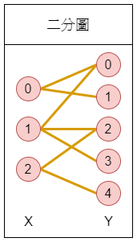

#

　　今天真中藍來到了木之幡米菈的家中，要進行補考的讀書會。不過米菈和藍一聊起天文的話題就忘記要讀書了。  
　　「還好我過來看了一下，不要偷懶，趕快念書！」鈴矢萌突然冒了出來，然後坐到了米菈的床上。  
　　「總覺得鈴同學在很熟米菈的家啊。」藍對鈴說道。  
　　「畢竟認識很久了，像是我知道這裡有米菈親筆天真爛漫的戀愛漫畫」鈴回答。  
　　「我要看！」藍一把拿走了漫畫去看。  
　　「不要啊！不要看啊！」米菈驚呼，並搶奪藍手中的漫畫。  
　　「米菈！米菈！不要推！啊啊啊啊啊啊～」米菈和藍跌坐在地上，藍的手腕被壓到而驚呼：「痛痛痛痛痛～」  
　　「不哭不哭，痛痛飛走啦。」米菈說。  
　　「別把我當小孩子！米菈妳看啦，我手腕扭到了，明天補考是要怎麼寫考卷啦」藍生氣地回答。  
　　「補考的題目不都是**二分圖匹配**嗎？」鈴說道。  
　　　　　　　　　　　　　　　　{ height=300px }  

\clearpage

　　「不要把『將**圖**中**兩**邊答案相同的點連起來的題目』叫作二分圖匹配好嗎？那叫作連連看。」藍回答。  
　　　　　　　{ height=300px }  
　　「好啦，連連看。連連看的題目中，點分成了左邊的 $A$ 區和右邊的 $B$ 區兩部分，妳需要將 $A$ 區與 $B$ 區的答案相同的點連起來，一個點必能跟另一區的恰好一個點連起來」  
　　「這我還是知道的。」藍嘀咕道。  
　　「雖然妳因為手腕扭到，只能畫出水平線、垂直線或左上到右下的直線。」（換句話說，除了斜率 $> 0$ 的線都可以畫。）  
　　「不過把整張考卷順時針旋轉90度，讓 $A$ 區的點變成在上方，$B$ 區的點在下方，這樣妳不就可以連另一個方向的線了嗎？」  
　　「這樣不是要旋轉很多次嗎？」藍回應。  
　　「米菈，那麼妳來算算這份連連看的題目，兩區的答案已經先給妳了，究竟藍要旋轉幾次考卷呢？」鈴對米菈說。  
　　「對了，為了避免迷糊的藍漏掉一些點沒連到，一定要按照 $A$ 的點編號依序連線唷，把 $A_i$ 點連線完才可以連線 $A_{i+1}$。」鈴繼續說。  
　　「我才沒有那麼迷糊！」藍生氣地回應。  

別忘了米菈也要參加補考，這個問題她可能答不上來，只好請你幫幫她囉。給一份已知答案的連連看，究竟需要旋轉幾次才能完成作答呢？  

\clearpage

## 輸入
第一行有一個整數 $N$，表示要連線點的組數。  
接下來有 $N$ 行，第 $i+1$ 行會有兩個整數 $A_i, B_i$，分別代表 $A$ 區第 $i$ 個點的答案與 $B$ 區第 $i$ 個點的答案。  

## 輸出
輸出一行為需要旋轉考卷的次數。  

## 輸入限制
 - $1 \leq N \leq 500$
 - $1 \leq A_i, B_i \leq N$

## 子任務

| 編號 | 分數 |    限制    |
| :---: | ---: | ---------- |
|  1  | 1 | 範例測資 |
|  2  | 24 | $1\leq N \leq 10$ |
|  3  | 25 | $1\leq N \leq 100$ |
|  4  | 50 | 無額外限制 |

\clearpage

## 範例輸入
```
6
1 2
2 3
3 1
4 4
5 6
6 5
```

## 範例輸出
```
3
```
