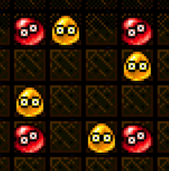

#

　　今天星咲高中的地科社的社員們窩在社辦裡，不過她們既不是在研究天文，也不是在討論地質，而是在玩著Puyo這款遊戲。  
　　至於Puyo是什麼，就讓社長森野真理來跟我們娓娓道來：「  

Puyo是一款消除類遊戲，盤面為高度 12 格、寬度 6 格，每格能夠容納一顆Puyo。  
　　　　　　　　　　　　　　　　{ height=150px }  
每次會從上方掉落兩顆相鄰的的Puyo，玩家可以進行旋轉（有4種方向，如上圖）並平移來決定放置的位置。  
玩家選擇放置的位置後，Puyo便會落下，掉落到下方已存在的Puyo上。  
若方向選擇平躺，而底下已存在的Puyo又不同高度，兩顆會各自掉落到下方的Puyo上，不會保持相鄰。  
落下的Puyo會和相鄰（上下左右）且相同顏色的Puyo相連，若相連的顆數大於等於 4 顆就會消除。  
Puyo消除後，上方的Puyo就會落下，若再次有同色相連達 4 顆就會繼續消除。  
在放置Puyo後的消除，每次消除為「1 連鎖」，若發生 5 次消除則稱為 5 連鎖。  
如果在一次消除內有兩組以上的Puyo被消除，也只計為同一次連鎖。  
如果已存在的Puyo已堆到高度 11 以上，導致落下的Puyo超過盤面高度，也算在盤面中，需進行消除計算。  

　　」，才剛說完，副社長櫻井美景馬上接著說：  
　　「哼哼！這個盤面我可以打出20連鎖。」  
　　「騙人！夢露學姊妳又在耍帥了！」米菈馬上提出質疑。  
　　「不過，妳也不知道最高可以幾連鎖吧？」藍接著說。  
　　「這究竟能夠幾連鎖呢？」豬瀨舞嘀咕道。  

的確在場的所有人都不知道這個盤面最高可以幾連鎖，所以現在要給你一個Puyo盤面和下一組Puyo，請你幫她們算算，在所有的放置位置中，能拿到的最高連鎖數為多少。  
保證給定的盤面不存在可立即消除的Puyo。  

\clearpage

## 輸入
第一行有兩個整數（無空格隔開），數值為 1 至 5，表示下一組的Puyo顏色。  
接下來有 12 行，每行有 6 個整數（無空格隔開），對於所有數字，若為 0，則代表該格為空格，若為 1 至 5，則代表該格的Puyo顏色。  
對於所有的空格，其上方一定是空格。  

## 輸出
輸出一行為連鎖次數。  

## 輸入限制
無。  

## 子任務
| 編號 | 分數 |    限制    |
| :---: | ---: | ---------- |
|  1  | 5 | 只有一色 |
|  2  | 10 | 保證最佳情況每次連鎖必剛好消除 4 顆，且最後能夠全消 |
|  3  | 15 | 最佳消除點為直放在最左邊那一行 |
|  4  | 70 | 無額外限制 |

\clearpage

## 範例輸入
```
12
000001
000034
000123
301223
101413
123414
234144
123422
123232
341323
334113
441222
```

## 範例輸出
```
15
```

## 提示
可使用這個模擬器來幫助作答：[https://cms.tfcis.org/contests/20200213TOIPre/puyo_simulator/puyo.html](https://cms.tfcis.org/contests/20200213TOIPre/puyo_simulator/puyo.html)  
範例輸入輸出的盤面為：[https://cms.tfcis.org/contests/20200213TOIPre/puyo_simulator/puyo.html?a8deada4cba3dec2ade2cdadbdcdecbdbecbdb2decbe2decececbdcec3bd2cb2de3](https://cms.tfcis.org/contests/20200213TOIPre/puyo_simulator/puyo.html?a8deada4cba3dec2ade2cdadbdcdecbdbecbdb2decbe2decececbdcec3bd2cb2de3)  
