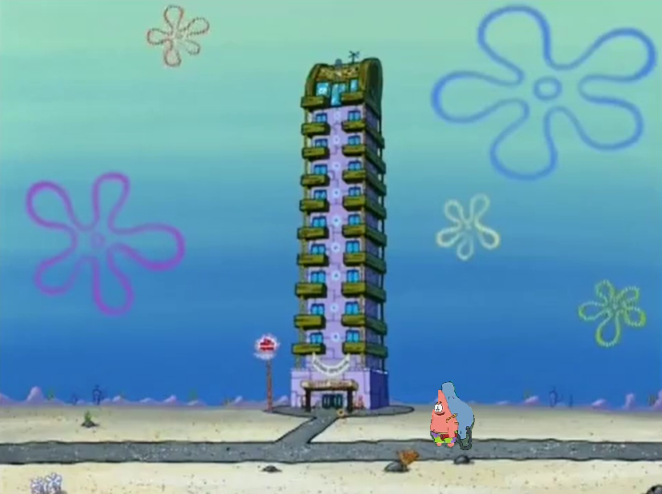

# 樓層交換


為了賺更多錢，蟹老闆將蟹堡王餐廳改建成了飯店。

　　　　　　　　　　　　　　　{ .center height=150px }  

飯店有 $N$ 層樓，每樓都有客房供客人租用。
然而，有個長期租房的大爛客人，總會用落葉吹風機來搞事：將兩個樓層（可能相同）交換。
而章魚哥有時就得幫忙善後，用他的落葉吹風機去把樓層給復原。

章魚哥每次復原樓層一定會是連續的一段樓層，例如 $2$ 樓到 $5$ 樓。
若章魚哥要復原 $l$ 樓到 $r$ 樓，他會先將當前第 $l$ 樓層與正確的第 $l$ 樓層（最一開始的第 $l$ 樓層）交換，再將當前第 $l+1$ 樓層與正確的第 $l+1$ 樓層交換，再往後繼續交換直到 $l$ 樓到 $r$ 樓都復原。

總共會有 $Q$ 次事件，每次事件會有兩種類型：大爛客人來搞事或章魚哥來復原樓層；請你對於每次章魚哥復原樓層，輸出他有效交換了幾次（交換的兩個樓層相異則這次交換是有效的）。

如果不太理解題目，請參考範例與範例解釋。

\clearpage

## 輸入
第一行有兩個整數 $N$ 和 $Q$，表示樓層數和事件數量。  
接下來有 $Q$ 行，每行開始有一個整數 $t$ 表示事件類型：若 $t = 1$，接下來有兩個整數 $a$ 與 $b$，表示大爛客人將當前的第 $a$ 樓層與第 $b$ 樓層交換；若 $t = 2$，接下來會有兩個整數 $l$ 與 $r$，表示章魚哥復原 $l$ 樓到 $r$ 樓。  

## 輸出
對於每次章魚哥復原樓層（$t = 2$ 的事件），輸出有效的交換次數。  

## 輸入限制
 - $1 \leq N, Q \leq 500000$
 - $1 \leq t\leq 2$
 - $1 \leq a, b \leq N$
 - $1 \leq l \leq r \leq N$

## 子任務
| 編號 | 分數 |    限制    |
| :---: | ---: | ---------- |
|  1  | 11 | $1 \leq N, Q \leq 500$，$a = b$ |
|  2  | 14 | $1 \leq N, Q \leq 500$ |
|  3  | 20 | $1 \leq N, Q \leq 5000$ |
|  4  | 55 | 無額外限制 |

\clearpage

## 範例輸入
```
6 7
1 1 2
1 2 3
1 4 4
2 4 4
1 5 6
2 1 4
2 3 6
```

## 範例輸出
```
0
2
1
```

## 範例解釋
飯店有 $6$ 層樓，共有 $7$ 筆事件。將樓層由低至高編號 $1$ 到 $6$。
一開始樓層編號由低至高依序為 $1,2,3,4,5,6$。

事件 $1$ 時，大爛客人將當前 $1$ 樓與 $2$ 樓交換；樓層編號由低至高變為 $2,1,3,4,5,6$。

事件 $2$ 時，大爛客人將當前 $2$ 樓與 $3$ 樓交換；樓層編號由低至高變為 $2,3,1,4,5,6$。

事件 $3$ 時，大爛客人將當前 $4$ 樓與 $4$ 樓交換；樓層編號由低至高還是 $2,3,1,4,5,6$。

事件 $4$ 時，章魚哥來復原 $4$ 樓到 $4$ 樓：
將當前 $4$ 樓與一開始的 $4$ 樓交換，樓層編號由低至高還是 $2,3,1,4,5,6$。
$4$ 樓到 $4$ 樓已復原完畢；而因為交換的兩樓層相同，有效交換次數為 $0$ 次。

事件 $5$ 時，大爛客人將當前 $5$ 樓與 $6$ 樓交換；樓層編號由低至高變為 $2,3,1,4,6,5$。

事件 $6$ 時，章魚哥來復原 $1$ 樓到 $4$ 樓：
將當前 $1$ 樓與一開始的 $1$ 樓交換，樓層編號由低至高變為 $1,3,2,4,6,5$。
將當前 $2$ 樓與一開始的 $2$ 樓交換，樓層編號由低至高變為 $1,2,3,4,6,5$。
將當前 $3$ 樓與一開始的 $3$ 樓交換，樓層編號由低至高還是 $1,2,3,4,6,5$。
將當前 $4$ 樓與一開始的 $4$ 樓交換，樓層編號由低至高還是 $1,2,3,4,6,5$。
$1$ 樓到 $4$ 樓已復原完畢；前兩次交換的樓層相異，因此有效交換次數為 $2$ 次。

事件 $7$ 時，章魚哥來復原 $3$ 樓到 $6$ 樓：
將當前 $3$ 樓與一開始的 $3$ 樓交換，樓層編號由低至高還是 $1,2,3,4,6,5$。
將當前 $4$ 樓與一開始的 $4$ 樓交換，樓層編號由低至高還是 $1,2,3,4,6,5$。
將當前 $5$ 樓與一開始的 $5$ 樓交換，樓層編號由低至高變為 $1,2,3,4,5,6$。
將當前 $6$ 樓與一開始的 $6$ 樓交換，樓層編號由低至高還是 $1,2,3,4,5,6$。
$3$ 樓到 $6$ 樓已復原完畢；第兩次交換的樓層相異，因此有效交換次數為 $1$ 次。